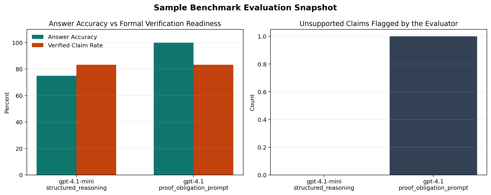
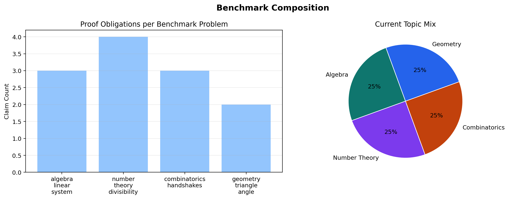
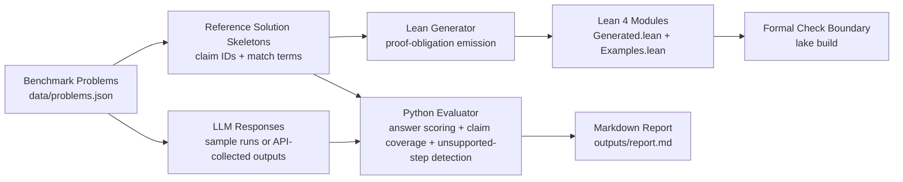

# Formal Math Benchmark & Reasoning Evaluator

A model can get the right AIME-style answer for the wrong reason.

This repository is a small but fully runnable research prototype for measuring that gap. It evaluates frontier LLM solutions to olympiad-style math problems, decomposes them into benchmark-aligned reasoning claims, and generates Lean 4 proof obligations so answer correctness and proof validity can be analyzed separately.

**Core idea:** answer-only benchmarks hide reasoning failures.  
**What this repo does:** score answers, score claim-level reasoning coverage, and map formalizable steps into Lean 4 theorems.

## Verification Snapshot

- Sample benchmark: 4 competition-style math problems across algebra, number theory, combinatorics, and geometry
- Evaluation dimensions: `answer_accuracy`, `claim_recall`, `verified_claim_rate`, `unsupported_claims`
- Formal backend: Lean 4 theorem generation + checked example modules
- Local build status: Python demo and tests pass; Lean modules compile



The point of the project is visible even in the seeded demo run: one model reaches `100%` final-answer accuracy, but that does not imply `100%` proof-level coverage or zero unsupported reasoning steps.

## Why This Exists

Most LLM math evaluations collapse everything into final-answer match. That is too weak for reasoning research.

This project is built around a stricter question:

> How often does a model produce a correct answer using a reasoning chain that is incomplete, unsupported, or not formalizable?

That framing maps directly onto current work in:

- formal verification of model reasoning
- neuro-symbolic evaluation
- theorem-proving-assisted alignment
- failure-mode analysis for advanced reasoning systems

## Visual Overview



The benchmark currently uses a compact, hand-curated dataset so every problem has an explicit solution skeleton and a well-defined set of proof obligations. The goal is not benchmark scale yet; the goal is clean measurement.

## System Design



### Layer Responsibilities

- `data/`: benchmark problems and seeded model responses
- `src/formal_math_benchmark/dataset.py`: typed benchmark loading
- `src/formal_math_benchmark/evaluation.py`: answer scoring, claim matching, unsupported-step detection
- `src/formal_math_benchmark/lean_generator.py`: Lean theorem generation for benchmark claims
- `src/formal_math_benchmark/reporting.py`: markdown report rendering
- `src/formal_math_benchmark/openai_runner.py`: optional OpenAI response collection adapter
- `lean/FormalMathBenchmark/Examples.lean`: checked reference examples
- `lean/FormalMathBenchmark/Generated.lean`: generated theorems tied to benchmark obligations

## What Gets Measured

The evaluator reports:

- `answer_accuracy`: exact final-answer correctness
- `claim_recall`: proportion of reference reasoning claims covered by a response
- `verified_claim_rate`: proportion of formalizable claims recovered by the response
- `unsupported_claims`: response steps that do not align with the benchmark’s proof skeleton

This lets the benchmark separate:

1. correct answer, correct reasoning
2. correct answer, incomplete reasoning
3. correct answer, unsupported reasoning
4. wrong answer, partially formalizable reasoning

That separation is the main research signal.

## Quickstart

### Python Demo

```bash
cd /path/to/formal-math-benchmark
python3 scripts/run_demo.py
```

This will:

- load the benchmark from `data/problems.json`
- evaluate the seeded runs in `data/sample_runs.json`
- write a markdown report to `outputs/report.md`
- generate Lean obligations in `lean/FormalMathBenchmark/Generated.lean`

### Generate README Figures

```bash
cd /path/to/formal-math-benchmark
MPLCONFIGDIR=$PWD/.mplconfig python3 scripts/generate_readme_figures.py
```

### Lean 4 Build

```bash
cd /path/to/formal-math-benchmark/lean
~/.elan/bin/lake build FormalMathBenchmark.Examples FormalMathBenchmark.Generated
```

## Reproducible Workflow

```bash
# 1. Run the benchmark demo
python3 scripts/run_demo.py

# 2. Run tests
python3 -m pytest -q tests/test_evaluation.py

# 3. Regenerate README figures
MPLCONFIGDIR=$PWD/.mplconfig python3 scripts/generate_readme_figures.py

# 4. Typecheck Lean modules
cd lean
~/.elan/bin/lake build FormalMathBenchmark.Examples FormalMathBenchmark.Generated
```

## Validation and Correctness

This repo is intentionally opinionated about evaluation quality.

### What Is Actually Verified

- Python evaluation pipeline is covered by `tests/test_evaluation.py`
- Lean example theorems are typechecked
- Generated Lean benchmark theorems are typechecked
- Sample report is produced from the same benchmark data that drives the README figures

### What Is Not Claimed

- full natural-language-to-Lean translation
- end-to-end formal verification of arbitrary model-generated proofs
- broad benchmark coverage across all olympiad domains

The current system is a benchmarked proof-obligation generator and evaluator, not a general theorem-proving autopilot. That narrower claim is deliberate.

## Technical Notes

### Benchmark Representation

Each problem contains:

- natural-language prompt
- canonical final answer
- structured solution skeleton
- formalizability flags
- Lean theorem identifiers
- match terms used for claim-level alignment

This keeps the evaluation grounded in explicit reasoning targets instead of post-hoc fuzzy grading.

### Lean Strategy

The Lean side currently uses two modes:

- hand-checked reference examples in `Examples.lean`
- generated benchmark-specific theorems in `Generated.lean`

For the seeded benchmark problems, the generator emits concrete theorem statements that compile under Lean 4. This gives the repo a real formal boundary rather than a decorative theorem-prover dependency.

## Repository Structure

```text
formal-math-benchmark/
├── data/
│   ├── problems.json
│   └── sample_runs.json
├── docs/
│   ├── images/
│   │   ├── benchmark_composition.png
│   │   └── model_comparison.png
│   └── methodology.md
├── lean/
│   ├── FormalMathBenchmark/
│   │   ├── Examples.lean
│   │   └── Generated.lean
│   ├── FormalMathBenchmark.lean
│   ├── lakefile.lean
│   └── lean-toolchain
├── outputs/
│   └── report.md
├── scripts/
│   ├── generate_readme_figures.py
│   └── run_demo.py
├── src/
│   └── formal_math_benchmark/
│       ├── dataset.py
│       ├── evaluation.py
│       ├── lean_generator.py
│       ├── models.py
│       ├── openai_runner.py
│       └── reporting.py
└── tests/
    └── test_evaluation.py
```

## Extension Path

The next obvious upgrades are:

- more benchmark problems with harder AIME-style number theory and combinatorics
- richer failure taxonomies beyond unsupported-claim detection
- automatic collection of fresh model outputs through the OpenAI API
- charts over larger evaluation runs instead of seeded snapshots
- partial translation of natural-language intermediate claims into Lean tactics or lemma templates
